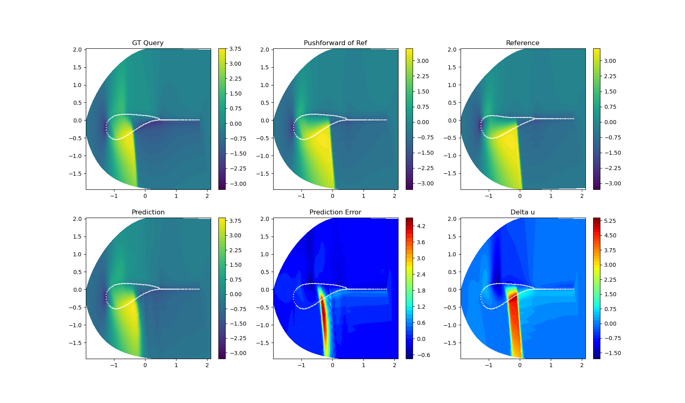
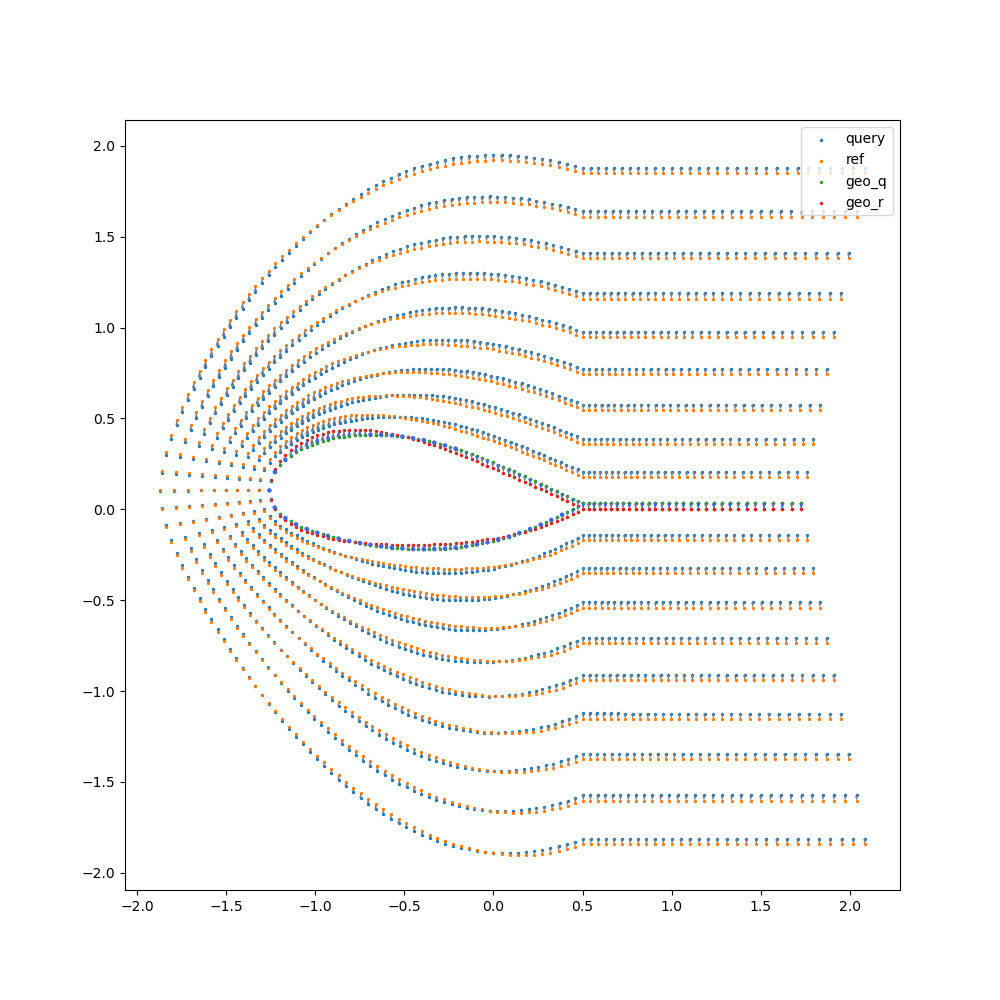
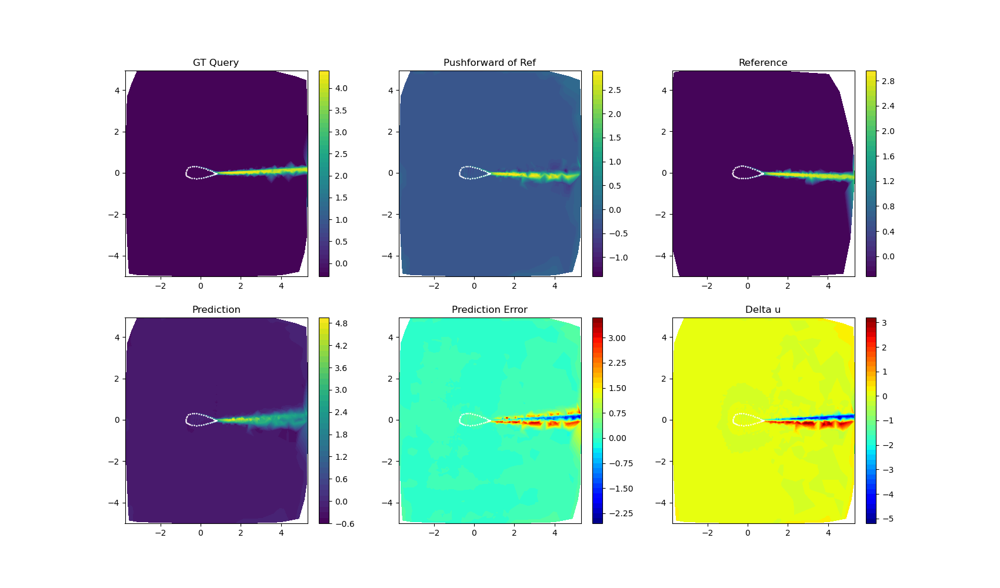
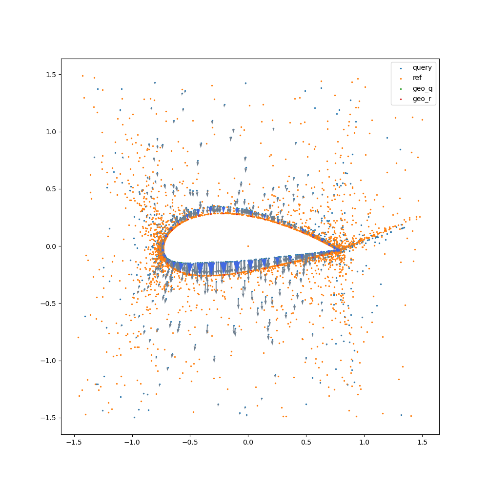
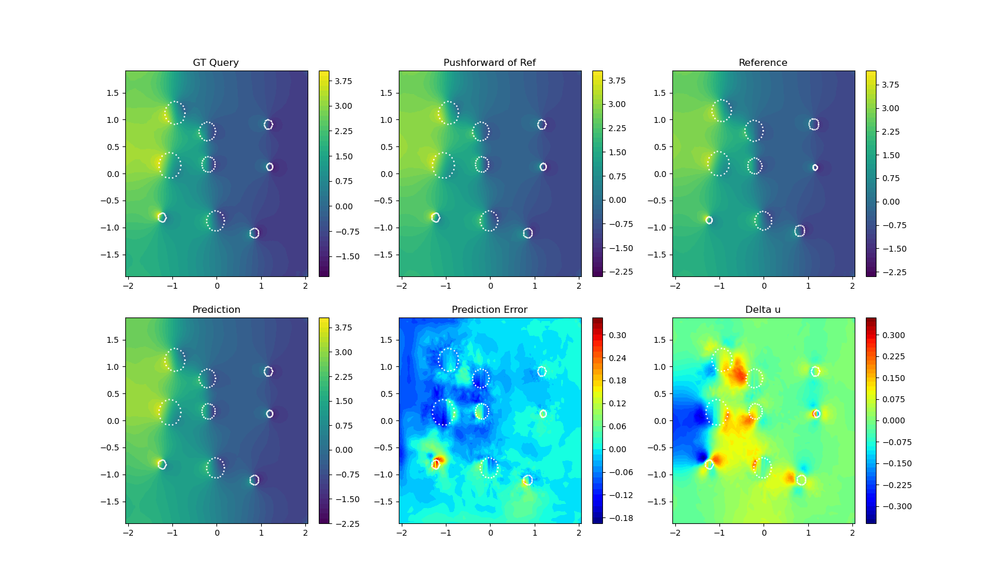
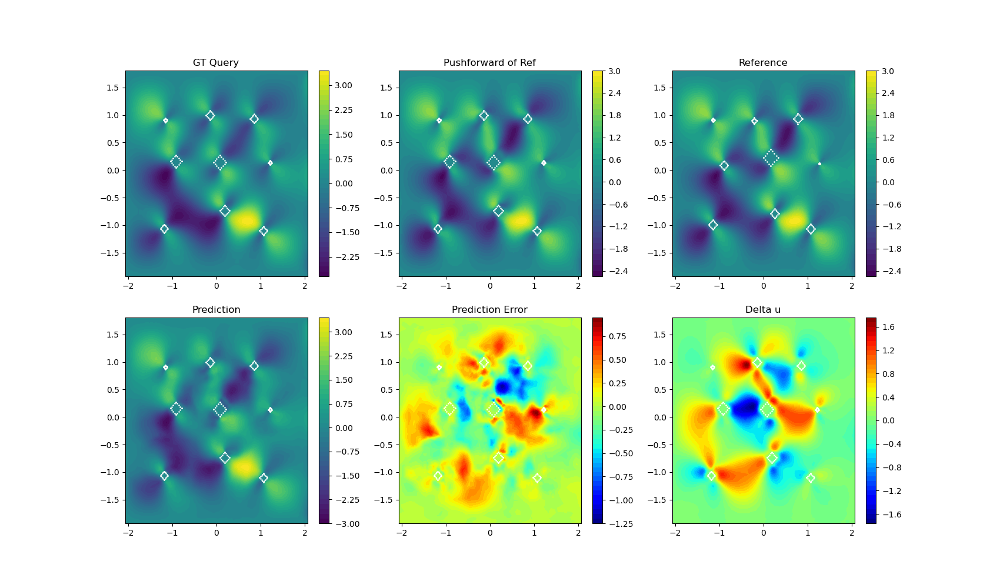

# RNO

Below are some samples from testing. Notice that RNO prediction reduces $\delta u$, the difference between GT query $u_q$ and pushforward of reference $u_r$.  

Figure 1. Visualization of Airfoil-Euler. The deformation for this dataset is easy to get since there is a 1-on-1 mapping of mesh grids between cases. The result is updated to
|    Model    |  l2 Error   |
| ----------- | ----------- |
|    CORAL    |    0.081    |
|    NU-FNO   |    0.147    |   
|   Geo-FNO   |    0.079    | 
|    GNOT     |   *0.04*    |
|  RNO (Ours) |  **0.034**  | 

Figure 2. Visualization of Airfoil-RANS, turbulent viscosity $\mu_t$, and an example of constructing deformation $\varphi$ with irregular mesh.

Figure 3. Visualization of NS2d-circle, pressure $p$. 

Figure 4. Visualization of NS2d-square, velocity component $v$. 
