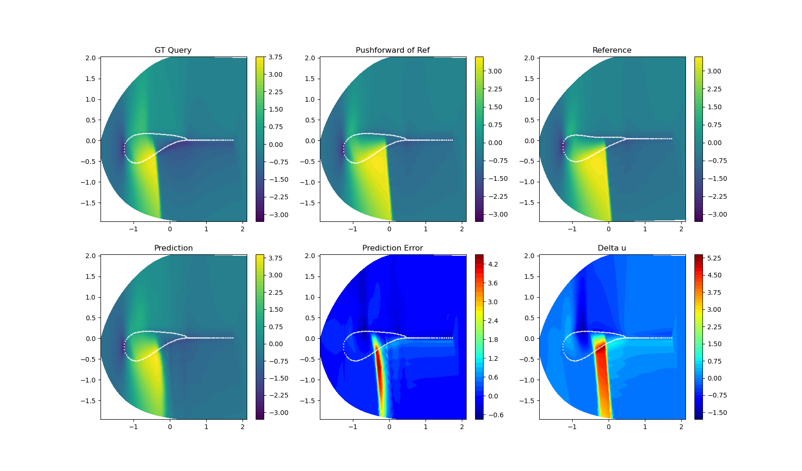
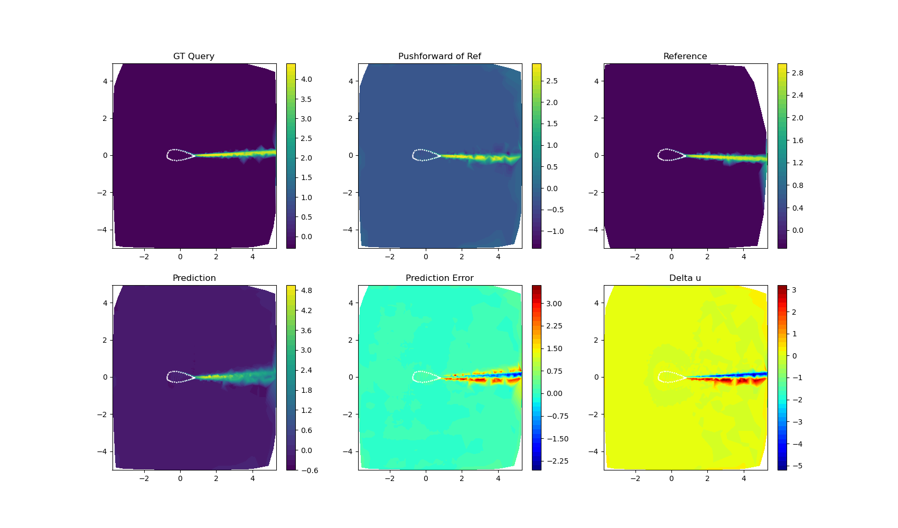
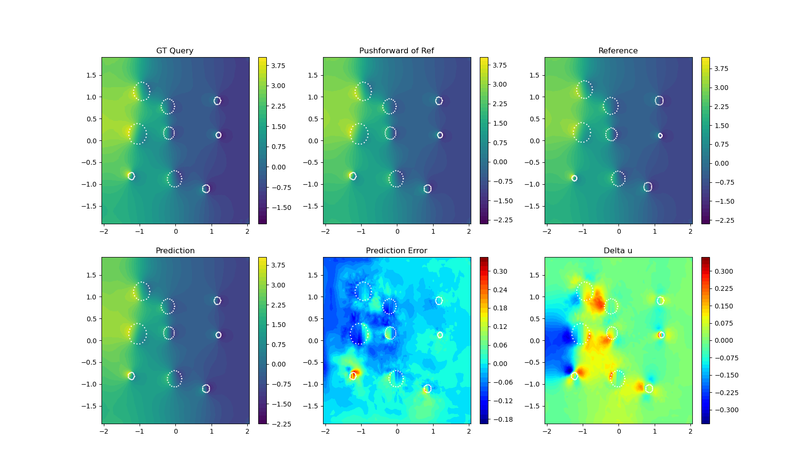
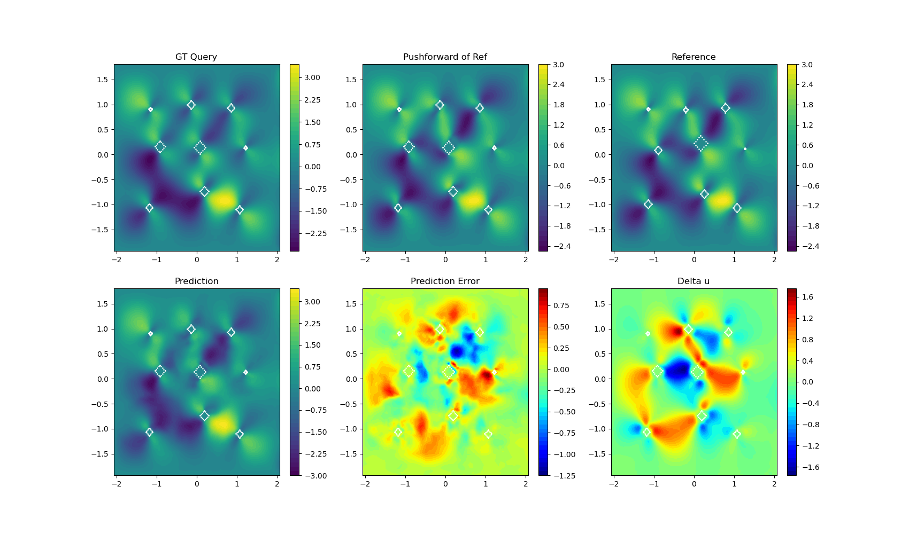

# RNO

Below are some samples from testing. Notice that RNO prediction reduces $\delta u$, the difference between GT query $u_q$ and pushforward of reference $u_r$.  

Figure 1. Visualization of Airfoil-Euler. 

Figure 2. Visualization of Airfoil-RANS, turbulent viscosity $\mu_t$. 

Figure 3. Visualization of NS2d-circle, pressure $p$. 

Figure 4. Visualization of NS2d-square, velocity component $v$. 
